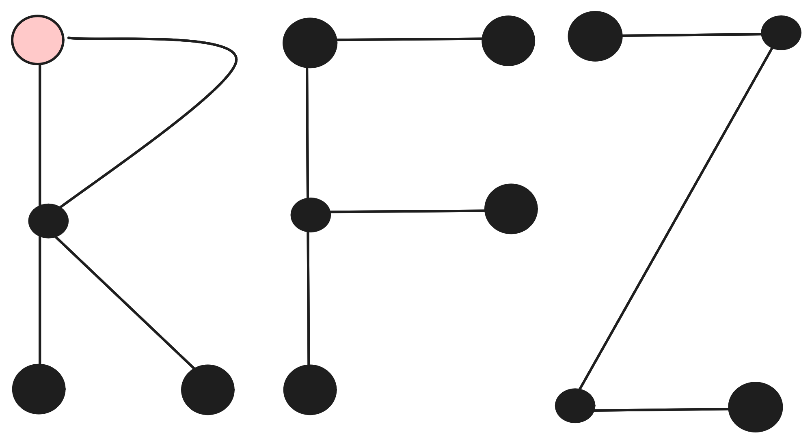

<h1 align="center">ReFedEz</h1>

  

**ReFedEz** 🚀 is a Python application and library designed to simplify the implementation and deployment of federated learning architectures. It provides a command-line interface (CLI) for deploying servers and clients directly in their target environments, ensuring consistency and reproducibility, and a Python library that seamlessly integrates into your machine learning code, enabling federated learning to work "like magic" with minimal modifications.

Federated learning is a powerful technique for training machine learning models across distributed data sources while maintaining privacy. ReFedEz serves as the "fast.ai of federated learning" – a beginner-friendly framework that prioritizes simplicity and rapid prototyping. It abstracts the underlying complexities, allowing researchers and developers to focus on their ML innovations rather than infrastructure challenges.

## Demo 🎥

Experience ReFedEz in action:

## Features ✨

- **Simplicity**: Deploy federated learning setups with ease, and adapt it with minimal code changes.
- **Multi-Backend Support**: Works with NumPy, PyTorch and TensorFlow.
- **Reproducible**: Bit by bit reproducible, thanks to nix and uv2nix.
- **Multi-Node encrypted by default**: Self-signed TLS certificates for the communication between nodes.

## Documentation 📚

For detailed guides, API reference, and more, visit the [Documentation](https://refedez.udl.cat).

## Contributing 🤝

Contributions are welcome! Please see the documentation for guidelines.

## License 📄

This project is licensed under the [MIT license](LICENSE)
